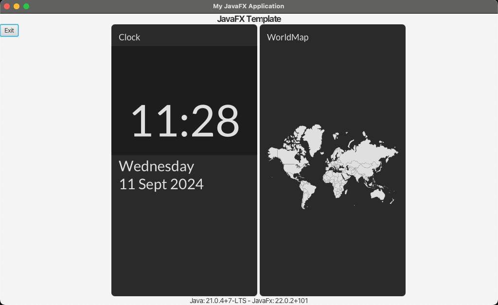
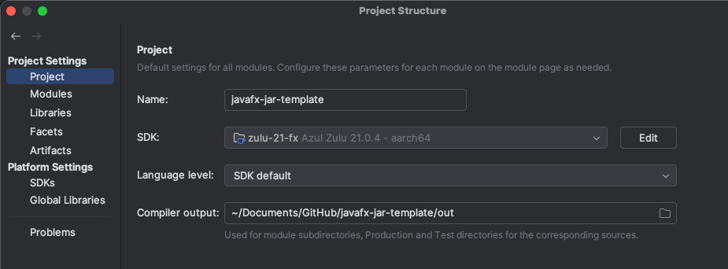
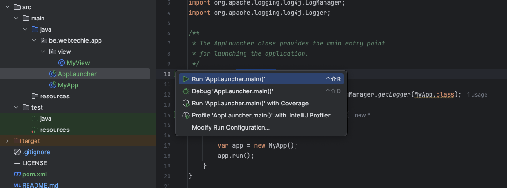

# JavaFX JAR Template

Template project to create a JavaFX project with dependencies and build it as an executable jar-file. This project contains TilesFX to illustrate the use of extra dependencies.



## Install Java SDK with JavaFX 

* This template requires Java 21 or newer.
* Use for instance Azul Zulu with JavaFX included.
* Check installation instructions on the Azul Documentation website:
  * [Windows](https://docs.azul.com/core/install/windows)
  * [macOS](https://docs.azul.com/core/install/macos)
  * [Linux](https://docs.azul.com/core/install/debian)
* Or use [SDKMAN](https://sdkman.io/) on Linux or macOS to easily install a JDK or switch to an other one:
```bash
# Install SDKMAN 
$ curl -s "https://get.sdkman.io" | bash
$ source "$HOME/.sdkman/bin/sdkman-init.sh"

# Install SDK and answer Y to set as default
$ sdk install java 21.0.4.fx-zulu
```

## Install Maven

* Follow the instructions on [the website of the Apache Maven Project](https://maven.apache.org/install.html).
* Or use [SDKMAN](https://sdkman.io/) on Linux or macOS:
```bash
$ sdk install maven
```

## Check Java and Maven version

```bash
$ java -version
openjdk version "21.0.4" 2024-07-16 LTS
OpenJDK Runtime Environment Zulu21.36+17-CA (build 21.0.4+7-LTS)
OpenJDK 64-Bit Server VM Zulu21.36+17-CA (build 21.0.4+7-LTS, mixed mode, sharing)

$ mvn -version
Apache Maven 3.9.6 (bc0240f3c744dd6b6ec2920b3cd08dcc295161ae)
Maven home: /Users/frank/.sdkman/candidates/maven/current
Java version: 21.0.4, vendor: Azul Systems, Inc., runtime: /Users/frank/.sdkman/candidates/java/21.0.4.fx-zulu/zulu-21.jdk/Contents/Home
Default locale: en_US, platform encoding: UTF-8
OS name: "mac os x", version: "14.6.1", arch: "aarch64", family: "mac"
```

## Use this project in IntelliJIDEA

1. Check out the sources
1. Open in IntelliJIDEA as a new Maven project
1. Configure a JDK with JavaFX in "Project Structure > SDK"

1. Go to the file `src/main/java/be/webtechie/app/AppLauncher.java`
1. Click on the green button "Run AppLauncher.main()"


## Build as executable JAR with all dependencies

1. Fill-in the name you want to use for your jar-file in `pom.xml` > build > finalName.
1. Make sure the `mainClass` is correct in `pom.xml` > build > plugin > maven-assembly-plugin.
1. Run the Maven `package` command `$ mvn package`.
1. You can now find the jar with all dependencies packages in `/target/{YOUR_FINALNAME}.jar`.
1. Run it with `java -jar target/{YOUR_FINALNAME}.jar`.